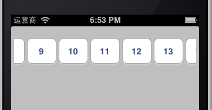

iOS-GTScrollButtonsView
=======================

A row of buttons in a scroll view, you can use it for paging and select different things.


Inherit from UIScrollView and add buttons into it.




## How To Use

It's very simple:

```
    GTScrollButtonsView *scrollView = [[GTScrollButtonsView alloc] initWithFrame:CGRectMake(5, 20, 310, 50)];
    [scrollView setButtonNumber:30 InitIndex:12];
    [self.view addSubview:scrollView];
    [scrollView release];
```

[Winlin](https://github.com/winlin)
